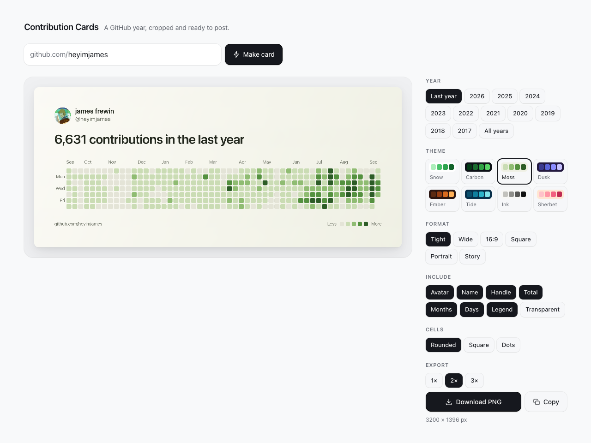

# Contribution Cards

Turn a GitHub contribution graph into a clean image you can post.

**[contribution-cards.vercel.app](https://contribution-cards.vercel.app)**



Type a username, pick a year, pick a look, download a PNG. No account, no API key,
no tracking, no cookies. Nothing is stored.

## What it does

- **Any year.** Every year the account has existed, plus a rolling "last year".
- **All years stacked.** One poster of a whole GitHub history. Silent early years
  are dropped so the active ones stay large.
- **Eight themes**, from GitHub's own palettes to gradients that look nothing like
  GitHub.
- **Six crops**: tight banner, wide, 16:9, square, portrait and 9:16 story, plus a
  transparent background option.
- **Download or copy** at 1×, 2× or 3×. The pixel size is shown before you export.

## Run it locally

```sh
pnpm install
pnpm dev          # http://localhost:3000
```

Next.js 16, React 19 and TypeScript. No UI library, no CSS framework, no motion
library, no API token.

## How it works

`app/api/contributions` reads the public contributions fragment GitHub serves at
`/users/<login>/contributions`. It is plain HTML that needs no token and carries a
`data-level` and a tooltip count for every day. Avatars are proxied through
`app/api/avatar` so the canvas stays same-origin and can still be exported: a
cross-origin image taints the canvas and silently breaks `toBlob`.

`lib/render.ts` paints the card. The preview on screen and the exported file come
from that one function, so the preview is the artwork rather than an approximation
of it. Every size derives from the card width, then the whole block is scaled by a
single factor if it would overflow a fixed-height format, which keeps proportions
honest at every aspect ratio.

## Two things worth knowing

- It depends on GitHub's calendar markup. If GitHub changes it, `lib/github.ts` is
  the one file to fix.
- Display names and join years come from the unauthenticated GitHub API, which is
  rate limited by IP. If that call fails the card still renders, falling back to the
  username and a wider list of years.

## Licence

MIT. See [LICENSE](LICENSE).
